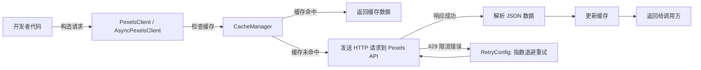

# 📸 pexels-python

> 一个功能完整、高性能的 **Pexels API Python 客户端库**，支持同步 & 异步调用，内置自动重试、缓存、分页迭代等高级特性。

[](https://pypi.org/project/pexels-python/)
[](https://pypi.org/project/pexels-python/)
[](LICENSE)

---

## 📑 目录
- [✨ 特性](#-特性)
- [📦 安装](#-安装)
- [🚀 快速开始](#-快速开始)
  - [基础使用](#基础使用)
  - [异步使用](#异步使用)
  - [分页迭代](#分页迭代)
  - [重试和缓存](#重试和缓存)
- [🛡️ 错误处理](#️-错误处理)
- [📝 日志配置](#-日志配置)
- [📚 示例代码](#-示例代码)
- [🧪 测试](#-测试)
- [📖 API 文档](#-api-文档)
- [🔧 配置选项](#-配置选项)
- [🤝 贡献](#-贡献)
- [📄 许可](#-许可)

---

## ✨ 特性

- 🔄 **自动重试机制**：对 429 限流错误自动重试，支持指数退避
- 🚀 **异步支持**：基于 `httpx` 的异步客户端，支持并发请求
- 📄 **分页迭代器**：自动翻页生成器，轻松处理大量数据
- 💾 **智能缓存**：支持内存和 Redis 缓存
- 🛡️ **丰富异常**：详细的异常类型与上下文信息
- 📝 **美化日志**：集成 `Rich` 的彩色日志
- 🎯 **类型注解**：完整类型提示
- 🧪 **完善测试**：高覆盖率测试套件

---

## 📊 Pexels API 调用流程



---

## 📦 安装

**使用 Poetry：**
```bash
poetry add pexels-python
````

**或使用 pip：**

```bash
pip install pexels-python
```

**本地开发：**

```bash
poetry install
```

---

## 🚀 快速开始

### 基础使用

```python
from pexels_python import PexelsClient

client = PexelsClient(api_key="YOUR_PEXELS_API_KEY")

photos = client.search_photos("cats", per_page=5)
print(f"找到 {photos['total_results']} 张照片")
```

### 异步使用

```python
import asyncio
from pexels_python import AsyncPexelsClient

async def main():
    async with AsyncPexelsClient(api_key="YOUR_API_KEY") as client:
        photos_task = client.search_photos("mountains", per_page=5)
        videos_task = client.search_videos("ocean", per_page=5)
        photos, videos = await asyncio.gather(photos_task, videos_task)
        print(f"照片: {len(photos['photos'])}, 视频: {len(videos['videos'])}")

asyncio.run(main())
```

### 分页迭代

```python
from pexels_python import iter_search_photos

for photo in iter_search_photos(client, "sunset", per_page=10, max_items=100):
    print(f"照片 ID: {photo['id']}, 摄影师: {photo['photographer']}")
```

### 重试和缓存

```python
from pexels_python import PexelsClient, RetryConfig, CacheManager

retry_config = RetryConfig(max_retries=3, base_delay=1.0, exponential_base=2.0)
cache_manager = CacheManager.create_memory_cache(max_size=100, ttl=300)

client = PexelsClient(
    api_key="YOUR_API_KEY",
    retry_config=retry_config,
    cache_manager=cache_manager
)
```

---

## 🛡️ 错误处理

```python
from pexels_python import (
    PexelsClient, 
    PexelsAuthError,
    PexelsRateLimitError, 
    PexelsBadRequestError,
    PexelsNotFoundError,
    PexelsServerError
)

client = PexelsClient(api_key="YOUR_API_KEY")

try:
    client.search_photos("test")
except PexelsAuthError as e:
    print(f"认证失败: {e.message}")
```

---

## 📝 日志配置

```python
from pexels_python import set_debug, set_info

set_debug()  # 启用调试日志
set_info()   # 切换为信息级别
```

---

## 📚 示例代码

在 `examples/` 目录：

* `basic_usage.py` - 基础功能
* `async_usage.py` - 异步客户端
* `pagination_example.py` - 分页功能
* `retry_and_cache_example.py` - 重试与缓存

运行示例：

```bash
export PEXELS_API_KEY="your_api_key_here"
poetry run python examples/basic_usage.py
```

---

## 🧪 测试

```bash
poetry run python -m pytest tests/ -v
```

---

## 📖 API 文档

**主要类：**

* `PexelsClient` - 同步客户端
* `AsyncPexelsClient` - 异步客户端
* `PaginationIterator` - 分页迭代器
* `RetryConfig` - 重试配置
* `CacheManager` - 缓存管理器

---

## 🔧 配置选项

### 重试配置

```python
RetryConfig(
    max_retries=3,
    base_delay=1.0,
    max_delay=60.0,
    exponential_base=2.0,
    jitter=True
)
```

### 缓存配置

```python
CacheManager.create_memory_cache(max_size=100, ttl=300)
CacheManager.create_redis_cache(host="localhost", port=6379, db=0, ttl=300)
```

---

## 🤝 贡献

欢迎提交 **Issue** 和 **Pull Request**！

---

## 📄 许可

[MIT License](LICENSE)
